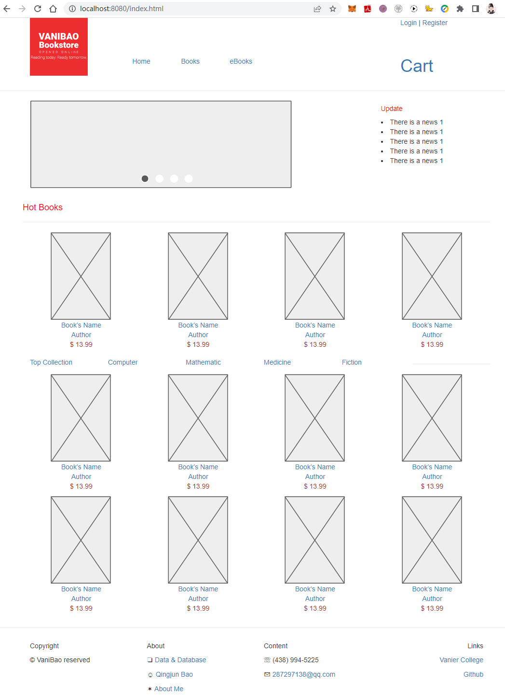
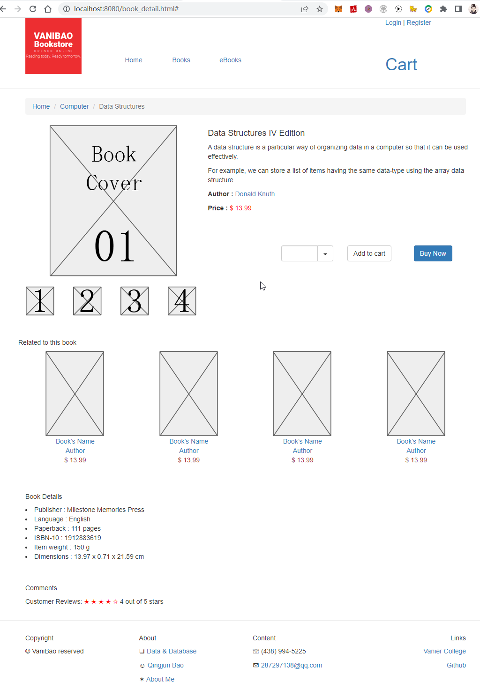
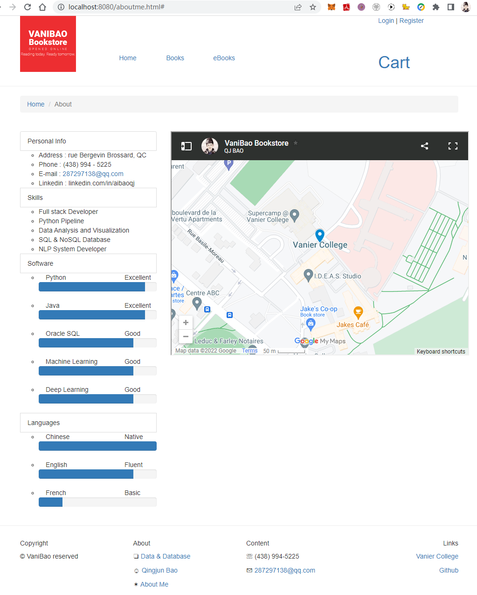

# VaniBao Bookstore Project Proposal

* [Outline of the project](#outline_the_project)
* [Project Function Flow Chart](#function_flow)
* [Web Page Prototype Design](#prototype_design)
* [Database Schema Design](#database_design)
* [Update Record](#update_record)
* [UI Screen Shot](#ui_screenshot)

---

<h2 id="outline_the_project"></h2>

## Outline of the project VaniBao Bookstore

**Project name :** Vanibao Bookstore Website

**Development language:** Java Html/Html5 CSS JavaScript

**Development framework:** Bootstrap jQuery

**Development platform:** VS Code / Photoshop

**Timeline :**

- 2022 July 1	-	Website Architecture Design
- 2022 July 9	-	Project plan, Screen shots, Web Pages
- 2022 July 28	-	Final Project Web Site

---
### o Purpose 
**why is it being developed?**

An online bookstore names VaniBao which users can purchase textbooks and reference books

### o Applicability
**who will use the system, and how will they benefit?**

Student or learner will use this online bookstore system, users can take a look the books’ cover, publication information of which books online, add to the shopping cart, and choose books to buy.

### o Goal
**what functionality do you want to develop?**

 
1.	Books List
    - Books classification
    - Books Details
    - Books Search

2.	User Management
    - Log in
    - register
    - change Password
    - Modify Personal Information

3.	Shopping Cart
    - Adding books
    - Quantity modification
    - Delete item
    - Empty cart

4.	Order management
    - Order Center
    - Transaction Record
    - My comments

5.	Application management
    - Favorites
    - Address management

<h2 id="function_flow"></h2>

## Project Function Flow Chart

### o Login and Register

<h2 id="prototype_design"></h2>

## Web Page Prototype Design

### Home Page

### Book Detail Page

### Shopping Cart Page

### Orders Page

VaniBao Bookstore Web Page Prototype Design link: [Google Document](https://docs.google.com/presentation/d/1uJhvNx98-ONlrOhoG8lj7gNIeNytHrPPOF4XgNWCDcI/edit?usp=sharing "VaniBao Bookstore")

<h2 id="database_design"></h2>

## Database Schema Design

- User Table : vb_users

| Field Name   | Type          | Constraint | Description     |
|  :---        |  :---         | :---:      |    :---         |
| user_id      | NUMBER        |  PK        | Primary Key     |
| login_name   | VARCHAR2(60)  |            | login name      |
| nick_name    | VARCHAR2(60)  |            | nick name       |
| grade_id     | NUMBER        |  FK        | member grade ID |
| password     | VARCHAR2(80)  |  NOT NULL  | password char   |
| email        | VARCHAR2(80)  |            | email address   |
| phone        | VARCHAR2(80)  |            | phone number    |
| head_img     | VARCHAR2(60)  |            | head image      |

- Book Table : vb_books 

| Field Name   | Type          | Constraint | Description     |
|  :---        |  :---         | :---:      |    :---         |
| book_id      | NUMBER        |  PK        | Primary Key     |
| book_name    | VARCHAR2(60)  |            | book's name     |
| category_id  | VARCHAR2(60)  |  FK        | category        |
| keywords     | VARCHAR2(60)  |            | keywords        |
| auther_id    | NUMBER        |  FK        | auther          |
| publisher_id | NUMBER        |  FK        | publisher       |
| language     | VARCHAR2(10)  |            | language        |
| edtion       | VARCHAR2(10)  |            | edtion          |
| isbn         | VARCHAR2(30)  |            | ISBN            |
| book_price   | NUMBER(9.2)   |            | book's price    |
| book_summary | VARCHAR2(500) |            | summary         |
| book_descrip | VARCHAR2(900) |            | description     |
| book_img     | VARCHAR2(60)  |            | book's image    |

- Order Table : vb_orders

- Receive Address Table : vb_receive_addr

- vb_payment

- vb_browse_log

- vb_interest

- vb_category

- vb_user_grade

<h2 id="ui_screenshot"></h2>

## UI Screen Shot

- Home Page

- Book Detail

- About Me

<h2 id="update_record"></h2>

## Update Record

| Version  | Action |   Task             |    Date    |
|  :---:   |  :---: | :---               |    :---:   |
| 01.00.00 | Create | Documents          | 2022-07-10 |
| 01.00.01 | Create | 3 html pages       | 2022-07-11 |
|          | Domain | aibao.me           | 2022-07-12 |

---
Copyright AI_Bao