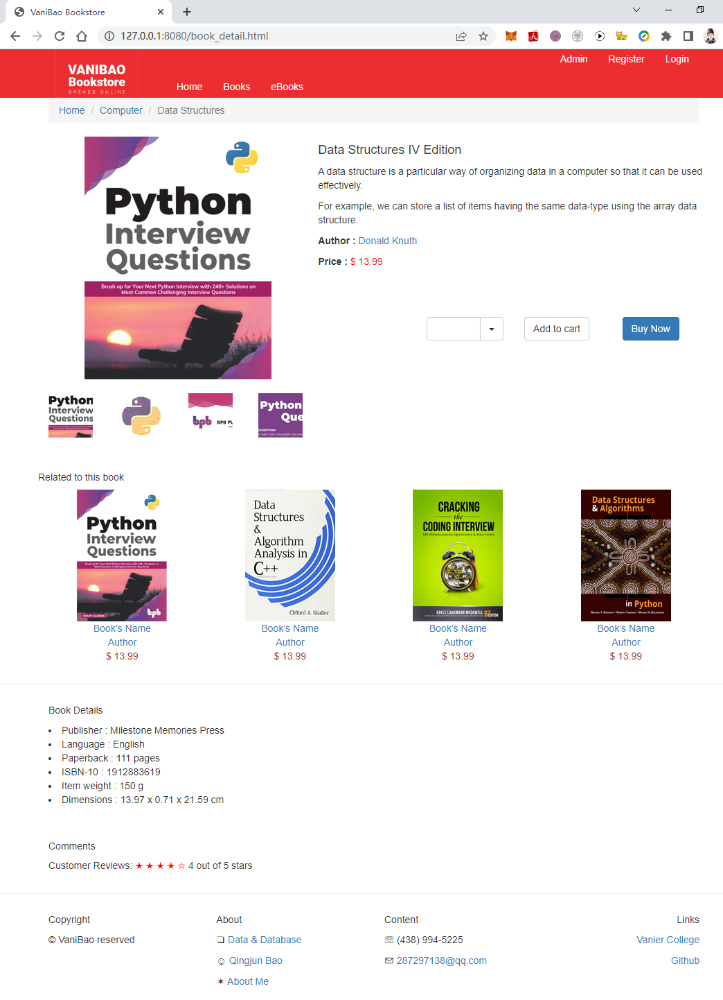
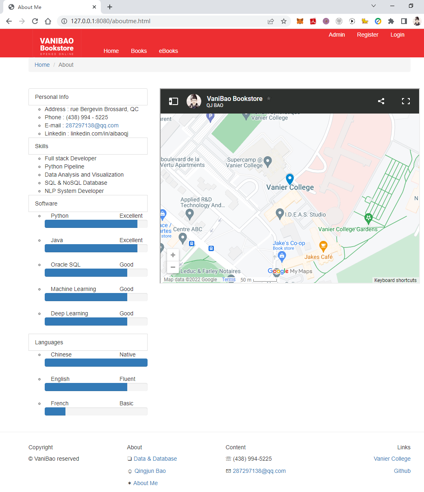
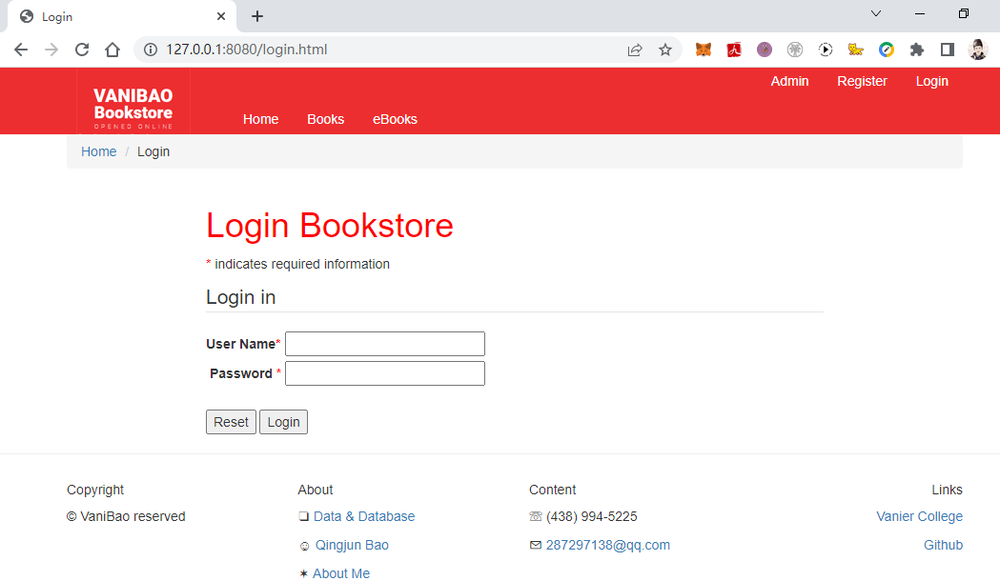
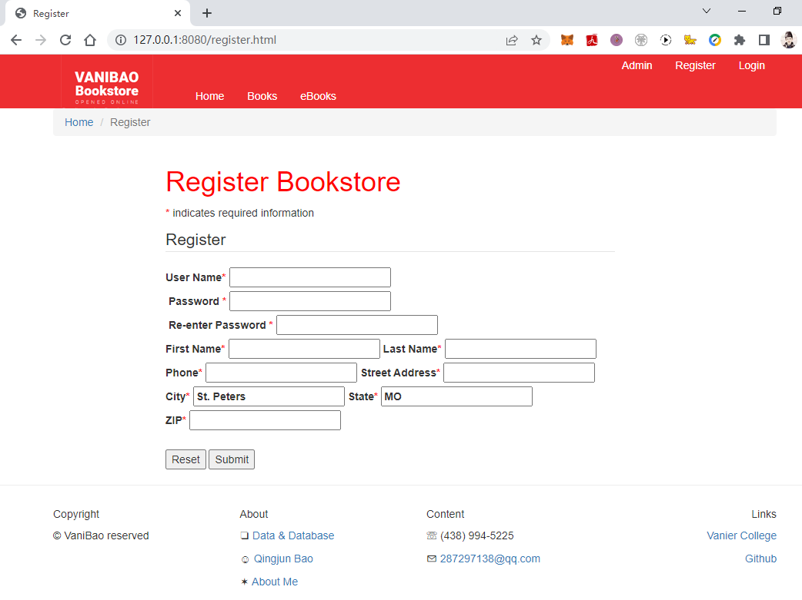
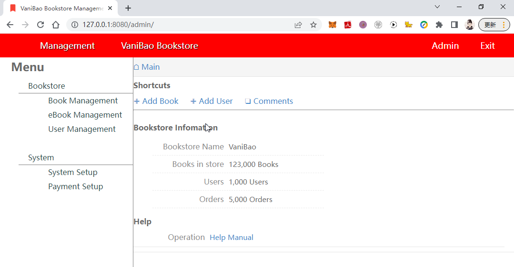
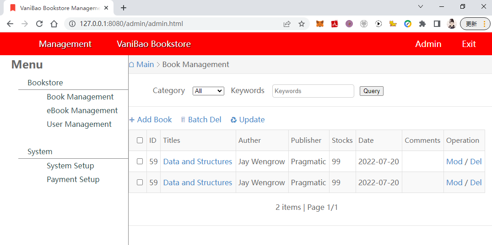
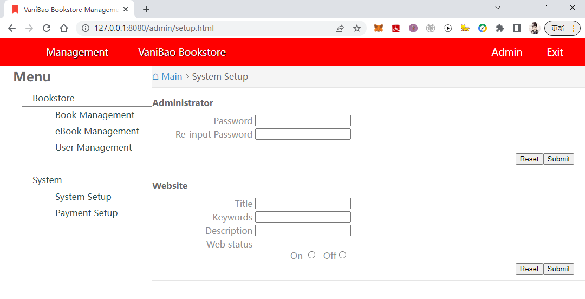

# VaniBao Bookstore Project Proposal

* [Outline of the project](#outline_the_project)
* [Project Function Flow Chart](#function_flow)
* [Web Page Prototype Design](#prototype_design)
* [Database Schema Design](#database_design)
* [Update Record](#update_record)
* [UI Screen Shot](#ui_screenshot)


---

**Website preview**

[http://aibao.me/](http://aibao.me/ "VaniBao Bookstore")


**Use Sunny-Ngrok**

https://www.ngrok.cc/_book/

Sunny-Ngrok启动工具.bat

隧道ID: 132429368338

Tunnel Status   online
Forwarding      http://aibao.free.idcfengye.com -> 127.0.0.1:8080
Web Interface   127.0.0.1:4040  

**Use open-dingtalk/pierced**


https://blog.csdn.net/LQM1528490339/article/details/111338131

https://github.com/open-dingtalk/pierced

```
ding -config ding.cfg -subdomain aibao 8080
```

http://aibao.vaiwan.com/

ding.cfg

```
server_addr: "vaiwan.com:443"
trust_host_root_certs: false
tunnels:
  web:
    subdomain: "aibao"
    proto:
      http: 127.0.0.1:8080
```

<h2 id="outline_the_project"></h2>

## Outline of the project VaniBao Bookstore

**Project name :** Vanibao Bookstore Website

**Development language:** Java Html/Html5 CSS JavaScript

**Development framework:** Bootstrap jQuery

**Development platform:** VS Code / Photoshop


**Timeline :**

- 2022 July 1	-	Website Architecture Design
- 2022 July 9	-	Project plan, Screen shots, Web Pages
- 2022 July 28	-	Final Project Web Site
- 2022 August 16	-	PHP programming
- 2022 August 26	-	Dynamic Website final version finish

---
### o Purpose 
**why is it being developed?**

An online bookstore names VaniBao which Vanier College students can purchase textbooks and reference books, and users can purchase a variety of paper books, teaching materials, extracurricular interest books, and online e-books. 
And provide online bookstore management functions.


### o Applicability
**who will use the system, and how will they benefit?**

Student or learner will use this online bookstore system, users can take a look the books’ cover, publication information of which books online, add to the shopping cart, and choose books to buy.

### o Website Map


### o Goal
**what functionality do you want to develop?**

 
1.	Books List
    - Books classification
    - Books Details
    - Books Search

2.	User Management
    - Log in
    - register
    - change Password
    - Modify Personal Information

3.	Shopping Cart
    - Adding books
    - Quantity modification
    - Delete item
    - Empty cart

4.	Order management
    - Order Center
    - Transaction Record
    - My comments

5.	Application management
    - Favorites
    - Address management


<h2 id="function_flow"></h2>

## Project Function Flow Chart

### o Bookstore Functions


### o Login and Register


<h2 id="prototype_design"></h2>

## Web Page Prototype Design

### Home Page


### Book Detail Page


### Shopping Cart Page


### Orders Page


VaniBao Bookstore Web Page Prototype Design link: [Google Document](https://docs.google.com/presentation/d/1uJhvNx98-ONlrOhoG8lj7gNIeNytHrPPOF4XgNWCDcI/edit?usp=sharing "VaniBao Bookstore")


<h2 id="database_design"></h2>

## Database Schema Design

- User Table : vb_users

| Field Name   | Type          | Constraint | Description     |
|  :---        |  :---         | :---:      |    :---         |
| user_id      | INT           |  PK        | Primary Key     |
| user_name    | VARCHAR(60)   |            | login name      |
| full_name    | VARCHAR(60)   |            | nick name       |
| password     | VARCHAR(80)   |  NOT NULL  | password char   |
| email        | VARCHAR(80)   |            | email address   |
| phone        | VARCHAR(20)   |            | phone number    |
| head_img     | VARCHAR(60)   |            | head image      |
| address1_id  | INT           |            | user's address 1|
| address2_id  | INT           |            | user's address 2|
| address3_id  | INT           |            | user's address 3|


- Book Table : vb_books 

| Field Name     | Type         | Constraint | Description     |
|  :---          |  :---        | :---:      |    :---         |
| book_id        | INT          |  PK        | Primary Key     |
| book_name      | VARCHAR(60)  |            | book's name     |
| category_id    | INT          |  FK        | category ID     |
| keywords       | VARCHAR(100) |            | keywords        |
| auther_id      | INT          |  FK        | auther ID       |
| publisher_id   | INT          |  FK        | publisher ID    |
| language       | VARCHAR(30)  |            | language        |
| edtion         | VARCHAR(30)  |            | edtion          |
| isbn           | VARCHAR(30)  |            | ISBN            |
| book_price     | DOUBLE(9,2)  |            | book's price    |
| book_summary   | VARCHAR(500) |            | summary         |
| book_descrip   | VARCHAR(900) |            | description     |
| book_img       | VARCHAR(60)  |            | book's image    |


- Address Table : vb_address

| Field Name     | Type         | Constraint | Description     |
|  :---          |  :---        | :---:      |    :---         |
| address_id     | INT          |  PK        | Primary Key     |
| user_id        | INT          |  FK        | user's ID       |
| full_name      | VARCHAR(60)  |            | postal name     |
| phone          | VARCHAR(20)  |            | phone number    |
| addr_street    | VARCHAR(60)  |            | postal street   |
| addr_city      | VARCHAR(20)  |            | postal city     |
| addr_province  | VARCHAR(20)  |            | postal province |
| postal_code    | VARCHAR(10)  |            | postal code     |


- Order Table : vb_orders

| Field Name     | Type         | Constraint | Description     |
|  :---          |  :---        | :---:      |    :---         |
| order_id       | INT          |  PK        | Primary Key     |
| order_num      | VARCHAR(60)  |  NOT NULL  | order number    |
| user_id        | INT          |  FK        | order user ID   |
| order_status   | VARCHAR(10)  |            | order's status  |
| create_date    | DATETIME     |            | create time     |
| payment_date   | DATETIME     |            | payment time    |
| ship_date      | DATETIME     |            | delivery time   |
| order_tax      | DOUBLE(9,2)  |            | order taxes     |
| order_price    | DOUBLE(9,2)  |            | order sum price |
| books_count    | INT          |            | how many books  |
| address_id     | INT          |  FK        | order address   |
| ship_fee       | DOUBLE(9,2)  |            | ship fee        |
| paidoff        | BOOLEAN      |            | paid off or not |
| shipped        | BOOLEAN      |            | shipped or not  |

- Ordered Books : vb_order_book

| Field Name     | Type         | Constraint | Description     |
|  :---          |  :---        | :---:      |    :---         |
| id             | INT          |  PK        | Primary Key     |
| order_id       | INT          |  FK        | Order ID        |
| book_id        | INT          |  FK        | book's ID       |
| book_name      | VARCHAR(60)  |            | book's name     |
| book_price     | DOUBLE(9,2)  |            | book's price    |
| book_count     | INT          |            | books amount    |

- Shopping Cart : vb_shoppingcart

| Field Name     | Type         | Constraint | Description     |
|  :---          |  :---        | :---:      |    :---         |
| id             | INT          |  PK        | Primary Key     |
| order_num      | VARCHAR(30)  |  FK        | order number    |
| user_id        | INT          |  FK        | user's ID       |
| book_id        | INT          |  FK        | book's ID       |
| book_count     | INT          |            | books amount    |
| book_price     | DOUBLE(9,2)  |            | book price      |
| instock        | BOOLEAN      |            | available or not|

- Users' browse log vb_browse_log

| Field Name     | Type         | Constraint | Description     |
|  :---          |  :---        | :---:      |    :---         |
| id             | INT          |  PK        | Primary Key     |
| user_id        | INT          |  FK        | user's ID       |
| browse_date    | DATETIME     |            | browse time     |
| book_id        | INT          |  FK        | book's ID       |
| book_name      | VARCHAR(60)  |            | book's name     |


- vb_category

| Field Name     | Type         | Constraint | Description     |
|  :---          |  :---        | :---:      |    :---         |
| id             | INT          |  PK        | Primary Key     |
| category       | VARCHAR(30)  |            | category        |


- vb_auther

| Field Name     | Type         | Constraint | Description     |
|  :---          |  :---        | :---:      |    :---         |
| id             | INT          |  PK        | Primary Key     |
| auther         | VARCHAR(60)  |            | auther name     |
| detail         | VARCHAR(200) |            | auther detail   |

- vb_publisher

| Field Name     | Type         | Constraint | Description     |
|  :---          |  :---        | :---:      |    :---         |
| id             | INT          |  PK        | Primary Key     |
| publisher      | VARCHAR(60)  |            | publisher name  |
| detail         | VARCHAR(200) |            | publisher detail|


- vb_news

| Field Name     | Type          | Constraint | Description     |
|  :---          |  :---         | :---:      |    :---         |
| news_id        | INT           |  PK        | Primary Key     |
| news_title     | VARCHAR(200)  |            | news title      |
| publish_date   | DATETIME      |            | publish time    |
| auther         | VARCHAR(80)   |            | auther          |
| news_content   | VARCHAR(200)  |            | news title      |


<h2 id="ui_screenshot"></h2>

## UI Screen Shot

- Home Page


- Book Detail



- About Me




- Login




- Register



- News Page


- Management Home Page



- Management Books Page



- Management Setup Page



<h2 id="update_record"></h2>

## Update Record

| Version  | Action |   Task             |    Date    |
|  :---:   |  :---: | :---               |    :---:   |
| 01.00.00 | Create | Documents          | 2022-07-10 |
| 01.00.01 | Create | 3 html pages       | 2022-07-11 |
|          | Domain | aibao.me           | 2022-07-12 |
|          | Create | Database Tables    | 2022-07-13 |
| 01.01.00 | Create | UI CSS renew       | 2022-07-30 |
| 01.02.00 | Create | PHP Register/Login | 2022-08-15 |

---
Copyright AI_Bao