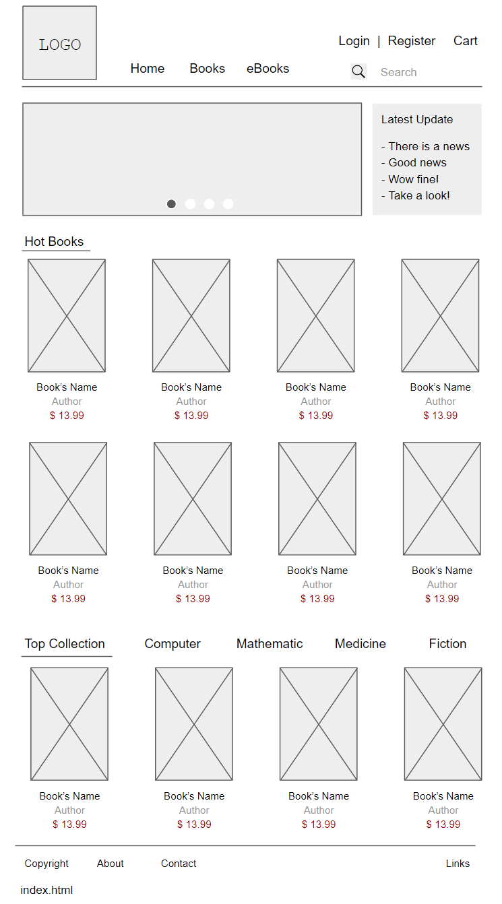
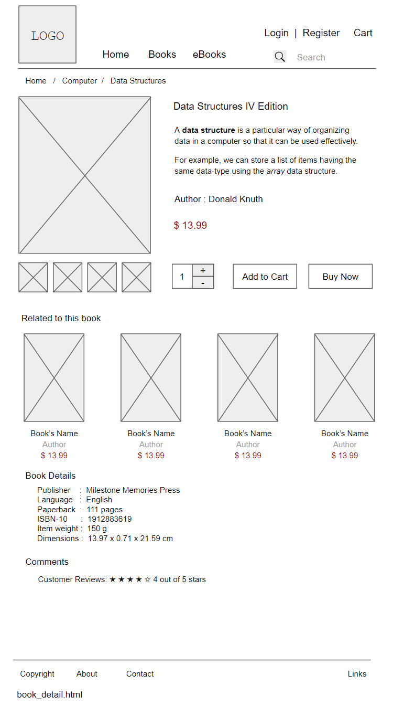
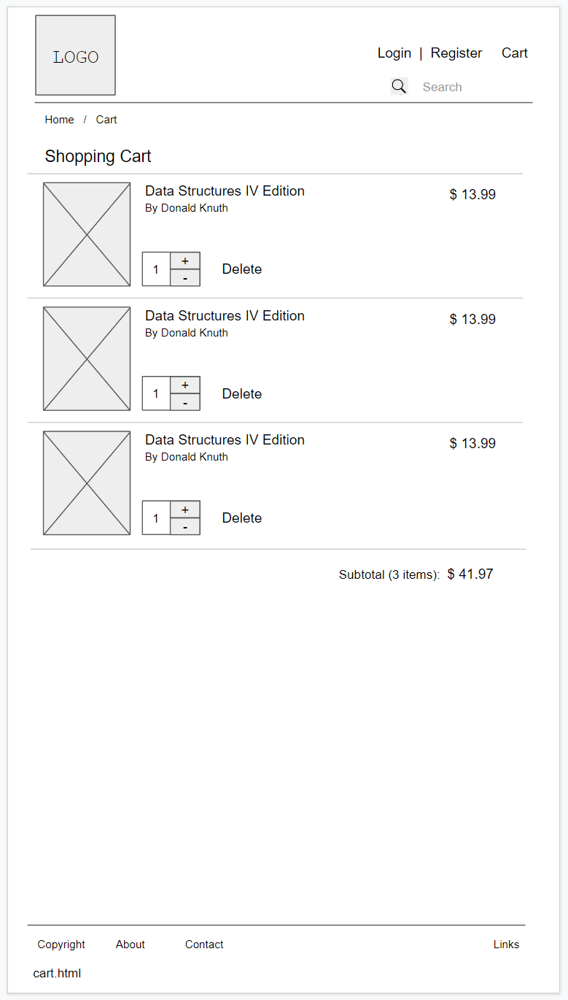

# VaniBao Bookstore Project Proposal
  
## Outline the project VaniBao Bookstore

**Project name :** Vanibao Bookstore Website

**Development language:** Java Html/Html5 CSS JavaScript

**Development platform:** VS Code Photoshop

**Timeline :**

- 2022 July 1	-	Website Architecture Design
- 2022 July 9	-	Project plan, Screen shots, Web Pages
- 2022 July 28	-	Final Project Web Site

---
### o Purpose 
**why is it being developed?**

An online bookstore names Vanibao which users can purchase textbooks and reference books

### o Applicability
**who will use the system, and how will they benefit?**

Student or learner will use this online bookstore system, users can take a look the books’ cover, publication information of which books online, add to the shopping cart, and choose books to buy.

### o Goal
**what functionality do you want to develop?**

 
1.	Books List
    - Books classification
    - Books Details
    - Books Search

2.	User Management
    - Log in
    - register
    - change Password
    - Modify Personal Information

3.	Shopping Cart
    - Adding books
    - Quantity modification
    - Delete item
    - Empty cart

4.	Order management
    - Order Center
    - Transaction Record
    - My comments

5.	Application management
    - Favorites
    - Address management

## Web Page Prototype Design

### Home Page

### Book Detail Page

### Shopping Cart Page

### Orders Page

VaniBao Bookstore Web Page Prototype Design link: [Google Document](https://docs.google.com/presentation/d/1uJhvNx98-ONlrOhoG8lj7gNIeNytHrPPOF4XgNWCDcI/edit?usp=sharing "VaniBao Bookstore")

---
Copyright AI_Bao