# VaniBao Bookstore Project Proposal

* [Outline of the project](#outline_the_project)
* [Project Function Flow Chart](#function_flow)
* [Web Page Prototype Design](#prototype_design)
* [Database Schema Design](#database_design)
* [Update Record](#update_record)
* [UI Screen Shot](#ui_screenshot)


---

**Website preview**

[http://aibao.me/](http://aibao.me/ "VaniBao Bookstore")


**Use Sunny-Ngrok**

https://www.ngrok.cc/_book/

Sunny-Ngrok启动工具.bat

隧道ID: 132429368338

Tunnel Status   online
Forwarding      http://aibao.free.idcfengye.com -> 127.0.0.1:8080
Web Interface   127.0.0.1:4040  

**Use open-dingtalk/pierced**


https://blog.csdn.net/LQM1528490339/article/details/111338131

https://github.com/open-dingtalk/pierced

```
ding -config ding.cfg -subdomain aibao 8080
```

http://aibao.vaiwan.com/

ding.cfg

```
server_addr: "vaiwan.com:443"
trust_host_root_certs: false
tunnels:
  web:
    subdomain: "aibao"
    proto:
      http: 127.0.0.1:8080
```

<h2 id="outline_the_project"></h2>

## Outline of the project VaniBao Bookstore

**Project name :** VaniBao Bookstore Website

**Author :** Qingjun Bao

**Last Update Date :** 2022-08-27

**Development language :** Html/Html5 CSS PHP

**Development framework :** Bootstrap

**Database :** MySQLi

**Development IDE :** VS Code


**Timeline**

- 2022 July 1	-	Website Architecture Design
- 2022 July 9	-	Project plan, Screen shots, Web Pages
- 2022 July 28	-	Final Project Web Site
- 2022 August 16	-	PHP programming
- 2022 August 26	-	Dynamic Website final version finish

---

### Website Development Features

1. PHP Language Object-Oriented programming thinking

1. Slideshow ads images on homepage

1. Use CSS statements "hover display: none; " to achieve drop down menu

1. Use "include" statement to achieve independent header footer

1. Use "SESSION" transfer parameters between pages

1. Use "<title>$page_title</title>" generate dynamic web page title.

1. Automatically identify whom Log in is administrator or not, then display the management entry

1. Automatically identify Shopping Cart empty or not, then display the different icon

1. Specific user's shopping cart with the query function

1. To generate dynamic breadcrumbs depending on book categories.

1. Determine the validity of the username and whether it is duplicated during Sign Up

1. Display user’s name after logged in.

1. Transfer parameters through "url?id=", then query data from database to display dynamic book_detail.php page

1. Determine whether the shopping cart is empty or not, dynamically display the “empty cart” image or shopping list details

1. Automatically calculate the total price of books with GST and QST taxes

1. Keyword search function, return approximate string matching result or no result

1. Embed Google Maps

1. Pushed on github


---

### o Purpose 
**why is it being developed?**

Create an online bookstore where readers and Vanier College students can purchase a variety of paper books, teaching materials, extracurricular interest books, and online e-books. 

Home page has menu bar navigation and arrange layout below with slideshow ads images, news bulletin board, hot book and sub-categories book list.

Registration and Login, Shopping Cart and Ordering functions.

Also provide online bookstore management functions.


### o Applicability
**who will use the system, and how will they benefit?**

Student or learner will use this online bookstore system, users can take a look the books’ cover, publication information of which books online, add to the shopping cart, and choose books to buy.

### o Website Map
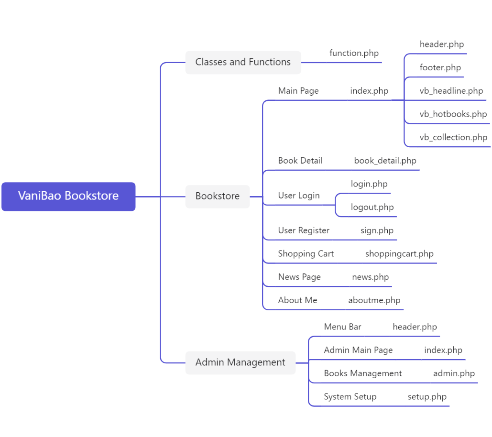


### o Goal
**what functionality do you want to develop?**

 
1.	Books List
    - Books classification
    - Books Details
    - Books Search

2.	User Management
    - Login
    - Sign up
    - change Password
    - Modify Personal Information

3.	Shopping Cart
    - Adding books
    - Quantity modification
    - Delete item
    - Empty cart

4.	Order management
    - Order Center
    - Transaction Record
    - My comments

5.	Application management
    - Favorites
    - Address management


<h2 id="function_flow"></h2>

## Project Function Flow Chart

### o Bookstore Functions
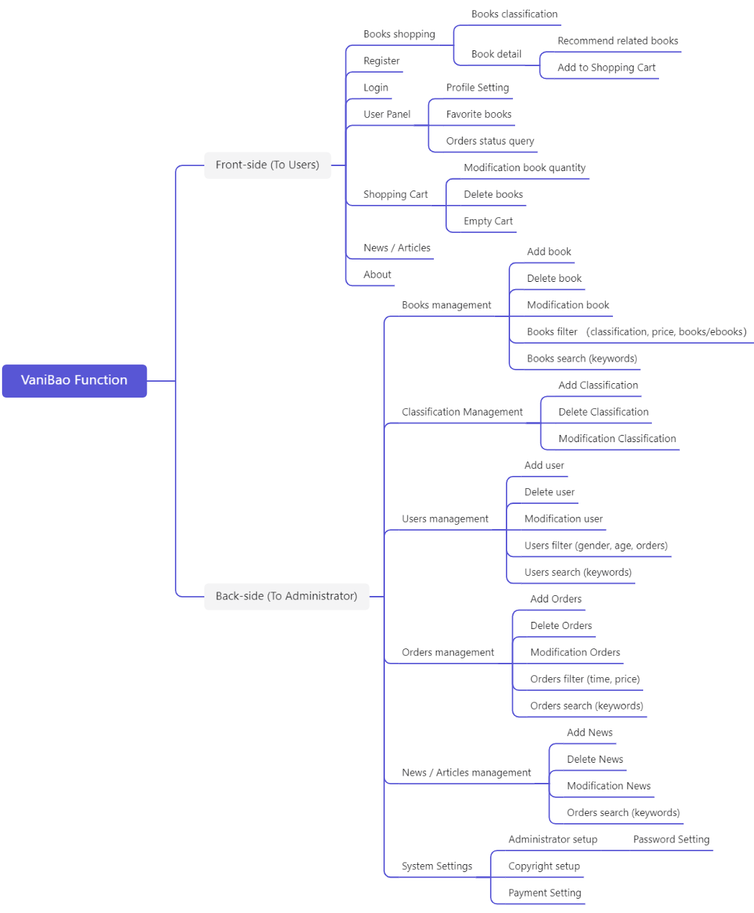

### o Login and Register
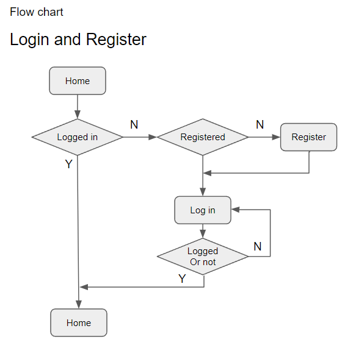


<h2 id="prototype_design"></h2>

## Web Page Prototype Design

### Home Page
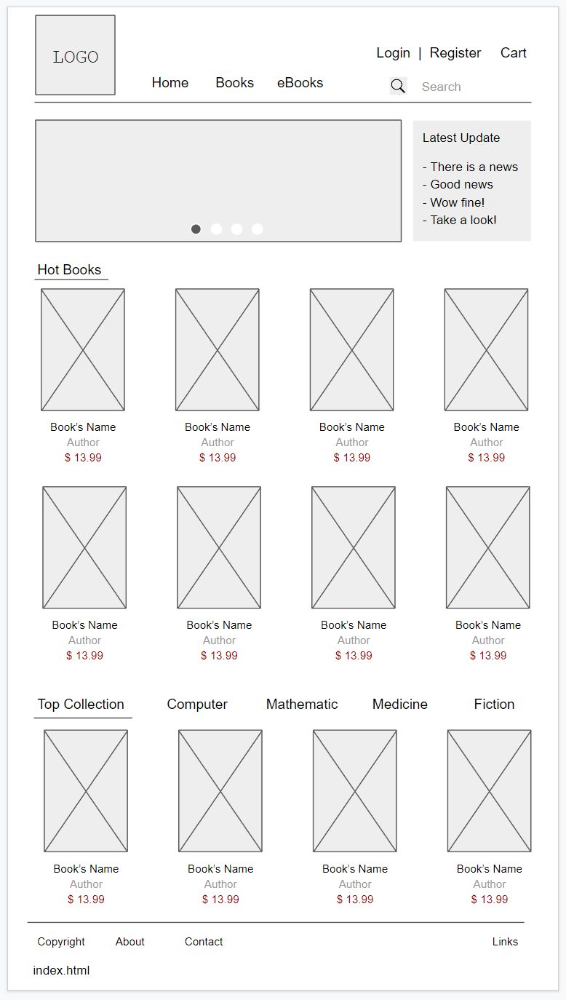

### Book Detail Page
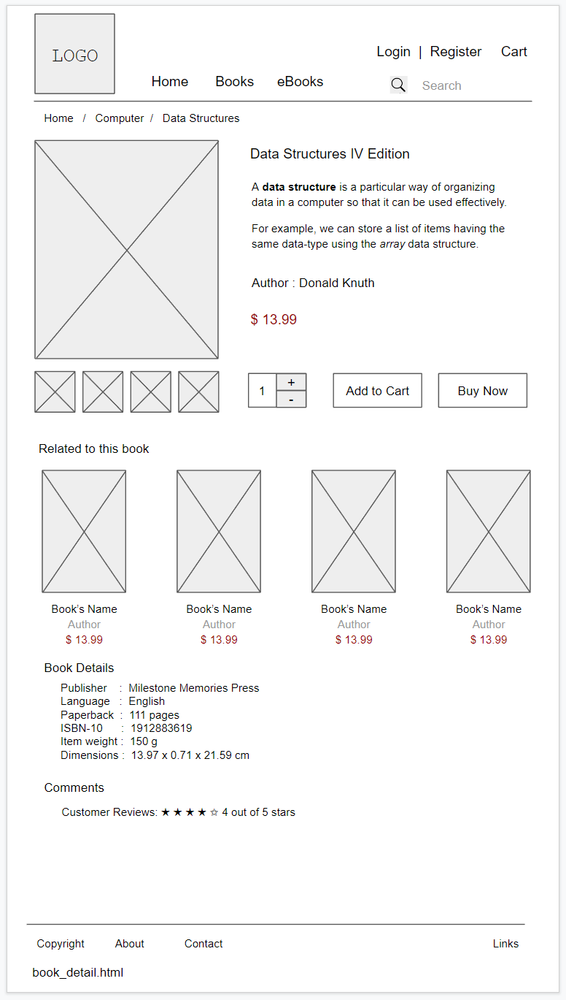

### Shopping Cart Page
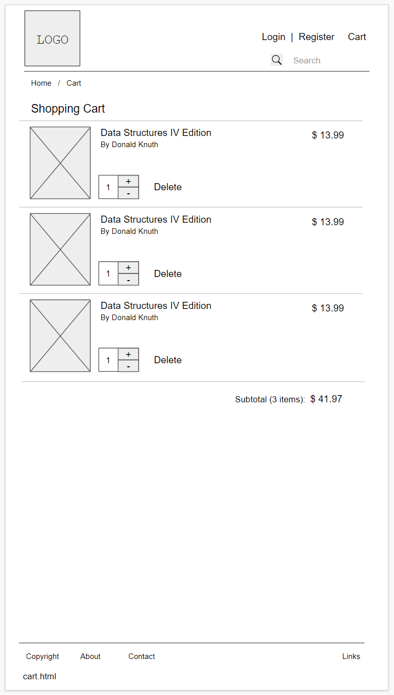

### Orders Page
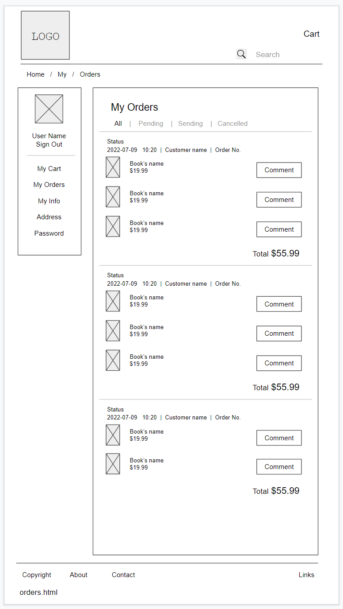

VaniBao Bookstore Web Page Prototype Design link: [Google Document](https://docs.google.com/presentation/d/1uJhvNx98-ONlrOhoG8lj7gNIeNytHrPPOF4XgNWCDcI/edit?usp=sharing "VaniBao Bookstore")


<h2 id="database_design"></h2>

## Database Design Purpose

**vb_users** is the user table, who browser log records in **vb_browse_log** table, **vb_orders** references user’s id from **vb_users** and address id from **vb_address** so that one user could have up to 3 addresses, **vb_order_book** table builds relationship between **vb_orders** and **vb_books** with **order_id** from **vb_orders** and **book_id** from **vb_books**. Then **vb_books** table store all the detail of books which references from **vb_category**, **vb_auther** and **vb_publisher**.

## Database Tables Imported in phpMyAdmin
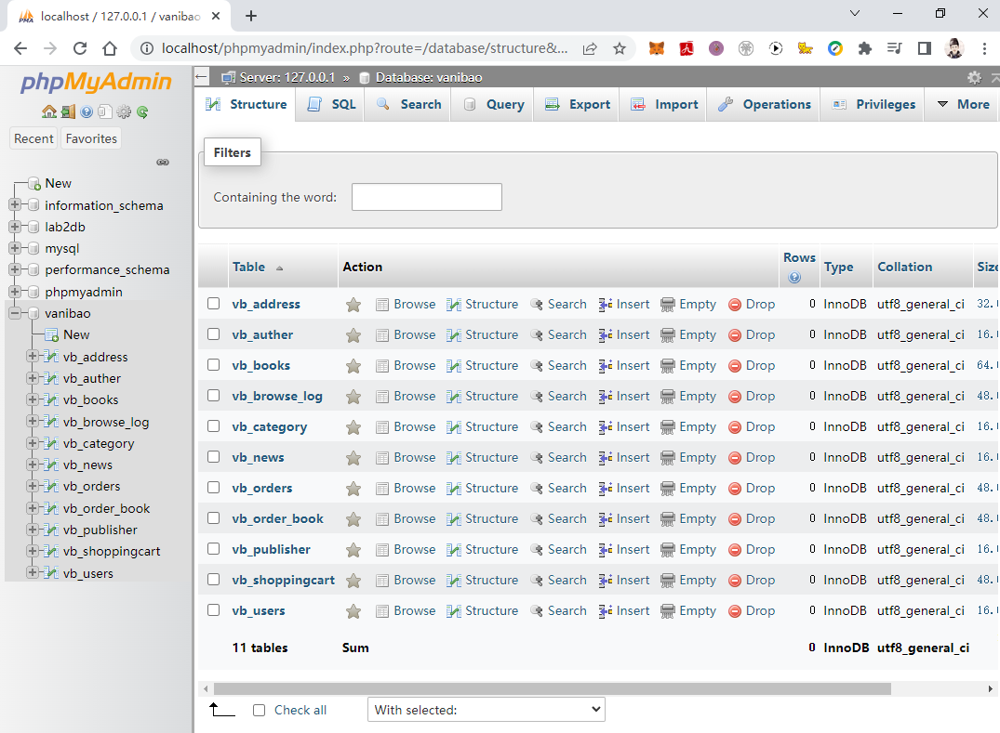

## Database ER Diagram
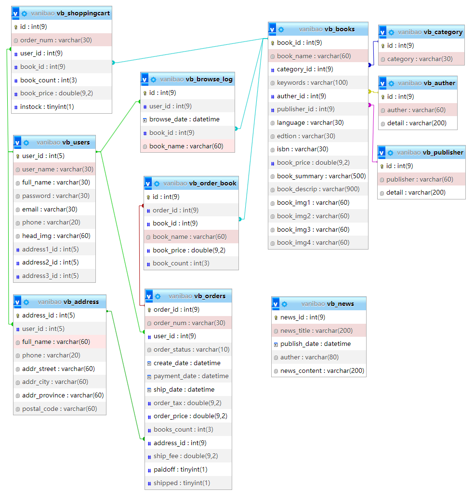

## Database Schema Design

- User Table : vb_users

| Field Name   | Type          | Constraint | Description     |
|  :---        |  :---         | :---:      |    :---         |
| user_id      | INT           |  PK        | Primary Key     |
| user_name    | VARCHAR(60)   |            | login name      |
| password     | VARCHAR(80)   |  NOT NULL  | password char   |
| email        | VARCHAR(80)   |            | email           |
| first_name   | VARCHAR(60)   |            | first name      |
| last_name    | VARCHAR(60)   |            | last name       |
| address1_id  | INT           |            | user's address 1|
| address2_id  | INT           |            | user's address 2|
| address3_id  | INT           |            | user's address 3|
| head_img     | VARCHAR(60)   |            | head image      |


- Book Table : vb_books 

| Field Name     | Type         | Constraint | Description     |
|  :---          |  :---        | :---:      |    :---         |
| book_id        | INT          |  PK        | Primary Key     |
| book_name      | VARCHAR(60)  |            | book's name     |
| category_id    | INT          |  FK        | category ID     |
| keywords       | VARCHAR(100) |            | keywords        |
| auther_id      | INT          |  FK        | auther ID       |
| publisher_id   | INT          |  FK        | publisher ID    |
| language       | VARCHAR(30)  |            | language        |
| edtion         | VARCHAR(30)  |            | edtion          |
| isbn           | VARCHAR(30)  |            | ISBN            |
| book_price     | DOUBLE(9,2)  |            | book's price    |
| book_summary   | VARCHAR(500) |            | summary         |
| book_descrip   | VARCHAR(900) |            | description     |
| book_img       | VARCHAR(60)  |            | book's image    |


- Address Table : vb_address

| Field Name     | Type         | Constraint | Description     |
|  :---          |  :---        | :---:      |    :---         |
| address_id     | INT          |  PK        | Primary Key     |
| user_id        | INT          |  FK        | user's ID       |
| first_name     | VARCHAR(60)  |            | first name      |
| last_name      | VARCHAR(60)  |            | last name       |
| phone          | VARCHAR(20)  |            | phone number    |
| addr_street    | VARCHAR(60)  |            | postal street   |
| addr_city      | VARCHAR(20)  |            | postal city     |
| addr_province  | VARCHAR(20)  |            | postal province |
| postal_code    | VARCHAR(10)  |            | postal code     |


- Order Table : vb_orders

| Field Name     | Type         | Constraint | Description     |
|  :---          |  :---        | :---:      |    :---         |
| order_id       | INT          |  PK        | Primary Key     |
| order_num      | VARCHAR(60)  |  NOT NULL  | order number    |
| user_id        | INT          |  FK        | order user ID   |
| order_status   | VARCHAR(10)  |            | order's status  |
| create_date    | DATETIME     |            | create time     |
| payment_date   | DATETIME     |            | payment time    |
| ship_date      | DATETIME     |            | delivery time   |
| order_tax      | DOUBLE(9,2)  |            | order taxes     |
| order_price    | DOUBLE(9,2)  |            | order sum price |
| books_count    | INT          |            | how many books  |
| address_id     | INT          |  FK        | order address   |
| ship_fee       | DOUBLE(9,2)  |            | ship fee        |
| paidoff        | BOOLEAN      |            | paid off or not |
| shipped        | BOOLEAN      |            | shipped or not  |

- Ordered Books : vb_order_book

| Field Name     | Type         | Constraint | Description     |
|  :---          |  :---        | :---:      |    :---         |
| id             | INT          |  PK        | Primary Key     |
| order_id       | INT          |  FK        | Order ID        |
| book_id        | INT          |  FK        | book's ID       |
| book_name      | VARCHAR(60)  |            | book's name     |
| book_price     | DOUBLE(9,2)  |            | book's price    |
| book_count     | INT          |            | books amount    |

- Shopping Cart : vb_shoppingcart

| Field Name     | Type         | Constraint | Description     |
|  :---          |  :---        | :---:      |    :---         |
| id             | INT          |  PK        | Primary Key     |
| order_num      | VARCHAR(30)  |  FK        | order number    |
| user_id        | INT          |  FK        | user's ID       |
| book_id        | INT          |  FK        | book's ID       |
| book_count     | INT          |            | books amount    |
| book_price     | DOUBLE(9,2)  |            | book price      |
| instock        | BOOLEAN      |            | available or not|

- Uers browse log vb_browse_log

| Field Name     | Type         | Constraint | Description     |
|  :---          |  :---        | :---:      |    :---         |
| id             | INT          |  PK        | Primary Key     |
| user_id        | INT          |  FK        | user's ID       |
| browse_date    | DATETIME     |            | browse time     |
| book_id        | INT          |  FK        | book's ID       |
| book_name      | VARCHAR(60)  |            | book's name     |

 
- vb_category

| Field Name     | Type         | Constraint | Description     |
|  :---          |  :---        | :---:      |    :---         |
| id             | INT          |  PK        | Primary Key     |
| category       | VARCHAR(30)  |            | category        |


- vb_auther

| Field Name     | Type         | Constraint | Description     |
|  :---          |  :---        | :---:      |    :---         |
| id             | INT          |  PK        | Primary Key     |
| auther         | VARCHAR(60)  |            | auther name     |
| detail         | VARCHAR(200) |            | auther detail   |

- vb_publisher

| Field Name     | Type         | Constraint | Description     |
|  :---          |  :---        | :---:      |    :---         |
| id             | INT          |  PK        | Primary Key     |
| publisher      | VARCHAR(60)  |            | publisher name  |
| detail         | VARCHAR(200) |            | publisher detail|


- vb_news

| Field Name     | Type          | Constraint | Description     |
|  :---          |  :---         | :---:      |    :---         |
| news_id        | INT           |  PK        | Primary Key     |
| news_title     | VARCHAR(200)  |            | news title      |
| publish_date   | DATETIME      |            | publish time    |
| auther         | VARCHAR(80)   |            | auther          |
| news_content   | VARCHAR(200)  |            | news title      |


## Database SQL Statements

```
CREATE TABLE vb_users (
    user_id INT(9) PRIMARY KEY AUTO_INCREMENT NOT NULL,
    user_name VARCHAR(30),
    password VARCHAR(30),
    email VARCHAR(30),
    first_name VARCHAR(30),
    last_name VARCHAR(30),
    address VARCHAR(90),
    head_img VARCHAR(60));

CREATE TABLE vb_category (
    id INT(9) PRIMARY KEY AUTO_INCREMENT,
    class INT(9),
    base_id INT(9),
    category VARCHAR(30));

CREATE TABLE vb_auther (
    id INT(9) PRIMARY KEY AUTO_INCREMENT,
    auther VARCHAR(60),
    detail VARCHAR(200));


CREATE TABLE vb_publisher (
    id INT(9) PRIMARY KEY AUTO_INCREMENT,
    publisher VARCHAR(60));

CREATE TABLE vb_books (
    book_id INT(9) PRIMARY KEY AUTO_INCREMENT,
    book_name VARCHAR(60),
    category1_id INT(9),
    category2_id INT(9),
    keywords VARCHAR(100),
    auther_id INT(9),
    publisher_id INT(9),
    language VARCHAR(30),
    edtion VARCHAR(30),
    isbn VARCHAR(30),
    book_price DOUBLE(9,2),
    book_summary VARCHAR(500),
    book_descrip VARCHAR(900),
    book_img1 VARCHAR(60),
    book_img2 VARCHAR(60),
    book_img3 VARCHAR(60),
    book_img4 VARCHAR(60),
    FOREIGN KEY (category1_id) REFERENCES vb_category(id),
    FOREIGN KEY (category2_id) REFERENCES vb_category(id),
    FOREIGN KEY (auther_id) REFERENCES vb_auther(id),
    FOREIGN KEY (publisher_id) REFERENCES vb_publisher(id));

CREATE TABLE vb_orders (
    order_id INT(9) PRIMARY KEY AUTO_INCREMENT,
    order_num VARCHAR(30),
    user_id INT(9),
    order_status VARCHAR(10),
    create_date DATETIME,
    payment_date DATETIME,
    ship_date DATETIME,
    order_tax DOUBLE(9,2),
    order_price DOUBLE(9,2),
    books_count INT(3),
    address_id INT(9),
    ship_fee DOUBLE(9,2),
    paidoff BOOLEAN,
    shipped BOOLEAN,
    FOREIGN KEY (user_id) REFERENCES vb_users(user_id),
    FOREIGN KEY (address_id) REFERENCES vb_address(address_id));

CREATE TABLE vb_order_book (
    id INT(9) PRIMARY KEY AUTO_INCREMENT,
    order_id INT(9),
    book_id INT(9),
    book_name VARCHAR(60),
    book_price DOUBLE(9,2),
    book_count INT(3),
    FOREIGN KEY (order_id) REFERENCES vb_orders(order_id),
    FOREIGN KEY (book_id) REFERENCES vb_books(book_id));

CREATE TABLE vb_shoppingcart (
    id INT(9) PRIMARY KEY AUTO_INCREMENT,
    user_id INT(9),
    book_id INT(9),
    book_count INT(3),
    book_price DOUBLE(9,2),
    instock BOOLEAN,
    FOREIGN KEY (user_id) REFERENCES vb_users(user_id),
    FOREIGN KEY (book_id) REFERENCES vb_books(book_id));

CREATE TABLE vb_browse_log (
    id INT(9) PRIMARY KEY AUTO_INCREMENT,
    user_id INT(9),
    browse_date DATETIME,
    book_id INT(9),
    book_name VARCHAR(60),
    FOREIGN KEY (user_id) REFERENCES vb_users(user_id),
    FOREIGN KEY (book_id) REFERENCES vb_books(book_id));

CREATE TABLE vb_news (
    news_id INT(9) PRIMARY KEY AUTO_INCREMENT,
    news_title VARCHAR(200),
    publish_date  DATETIME,
    auther VARCHAR(80),
    news_content VARCHAR(200));

```

<h2 id="ui_screenshot"></h2>

## UI Screen Shot

- Home Page

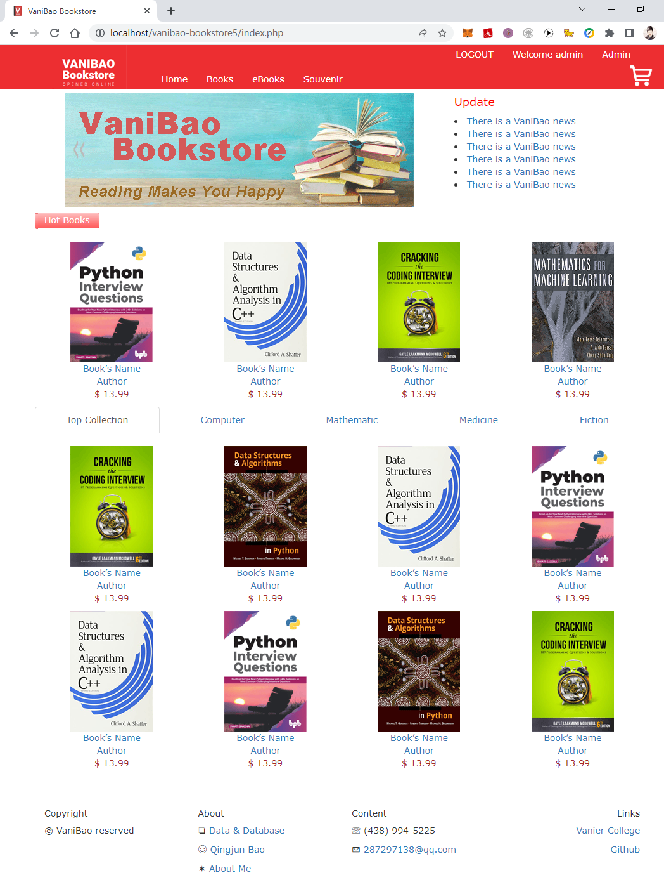

- Home Page Drop-down Menu achieved by CSS


- Book Detail

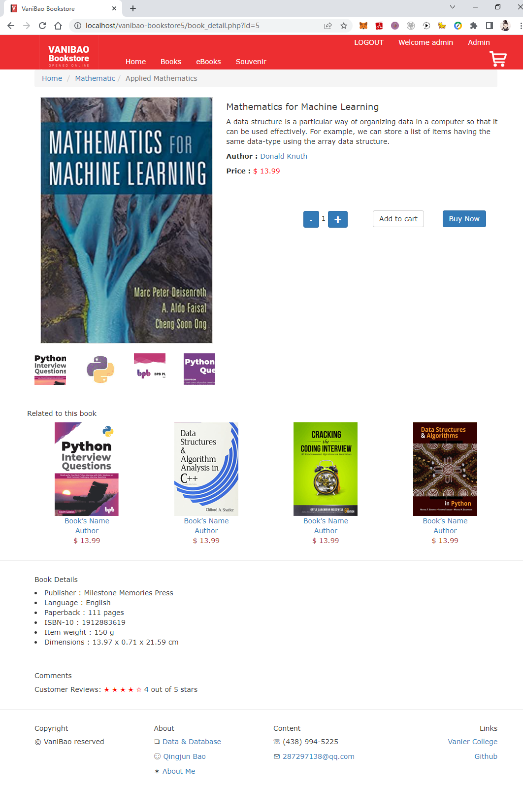

- Sign Up

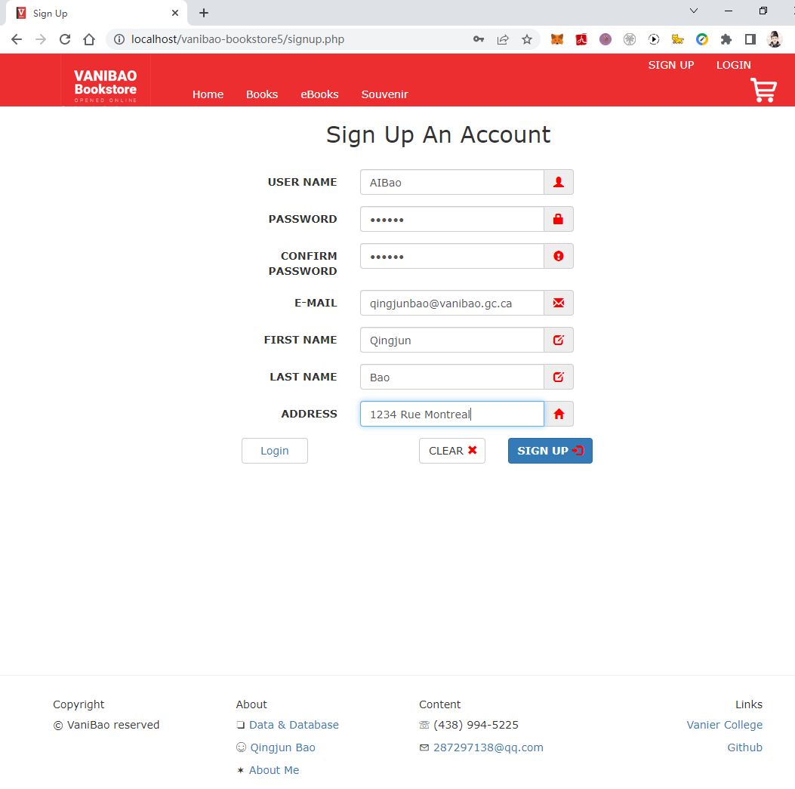

- Login

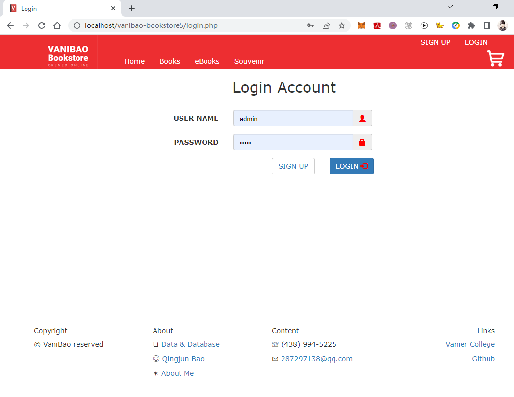

- Shopping Cart

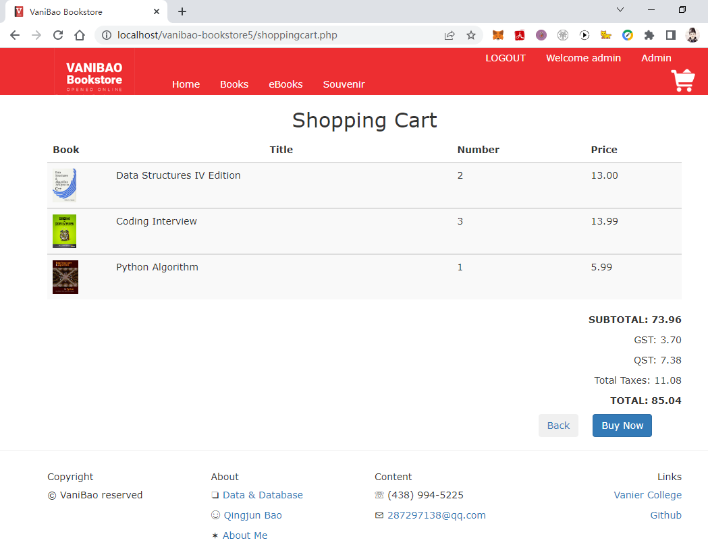

- Shopping Cart Empty

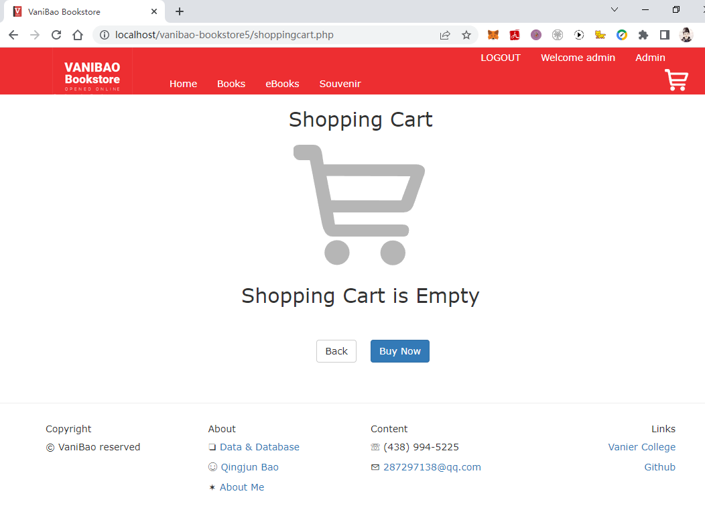

- Search Books keyword="computer"

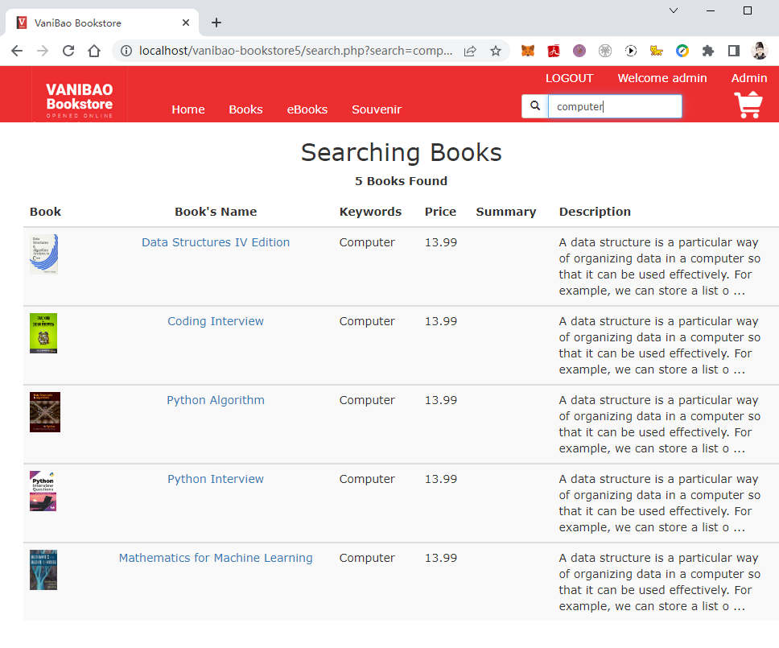

- Search Books keyword="inter"

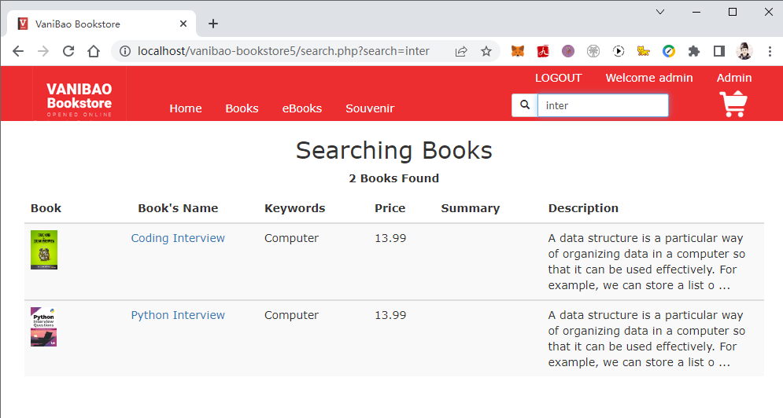

- Search Books keyword="math"

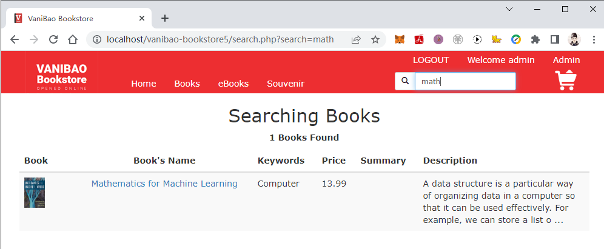

- Search Books No Result

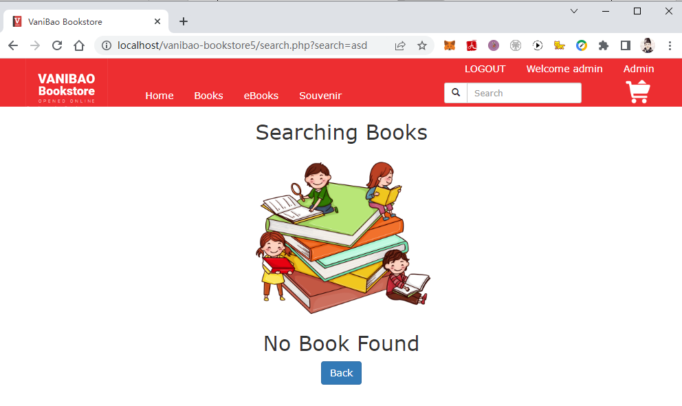


- About Me

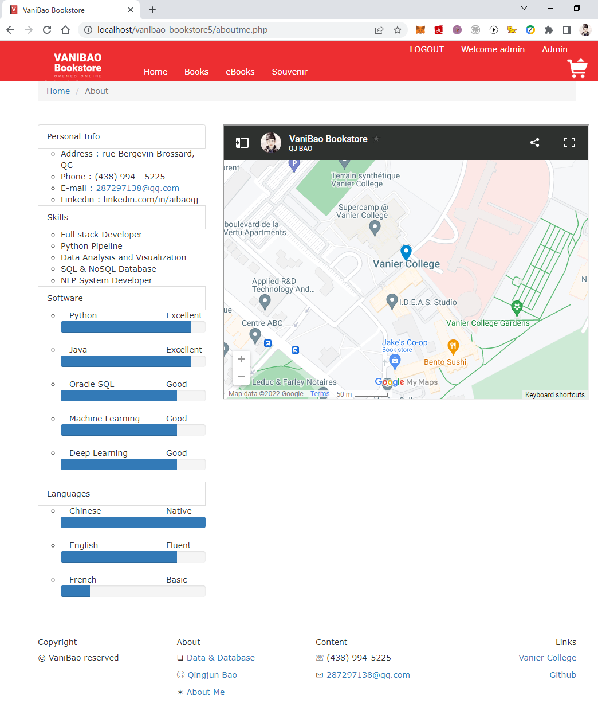

- News Page


- Management Home Page

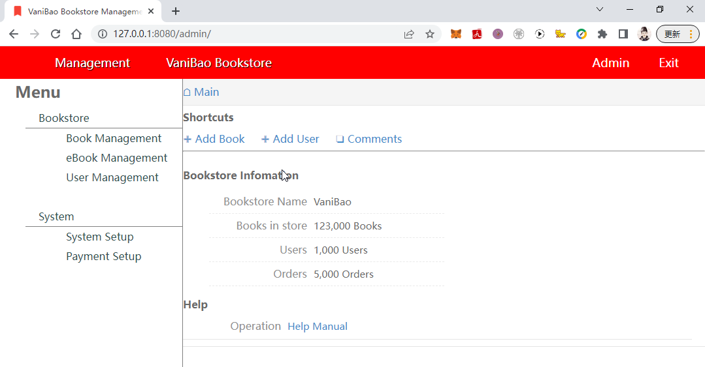

- Management Books Page

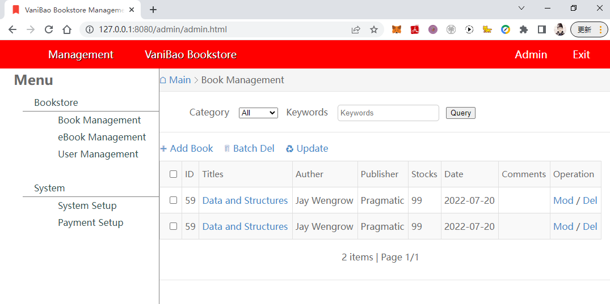

- Management Setup Page

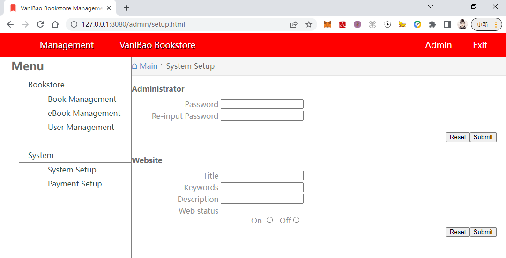

<h2 id="update_record"></h2>

## Update Record

| Version  | Action |   Task             |    Date    |
|  :---:   |  :---: | :---               |    :---:   |
| 01.00.00 | Create | Documents          | 2022-07-10 |
| 01.00.01 | Create | 3 html pages       | 2022-07-11 |
|          | Domain | aibao.me           | 2022-07-12 |
|          | Create | Database Tables    | 2022-07-13 |
| 01.01.00 | Create | UI CSS renew       | 2022-07-30 |
| 01.02.00 | Create | PHP Register/Login | 2022-08-15 |
| 01.03.00 | Create | PHP query          | 2022-08-23 |
| 01.04.00 | Create | PHP SESSION        | 2022-08-27 |

---
Copyright AI_Bao